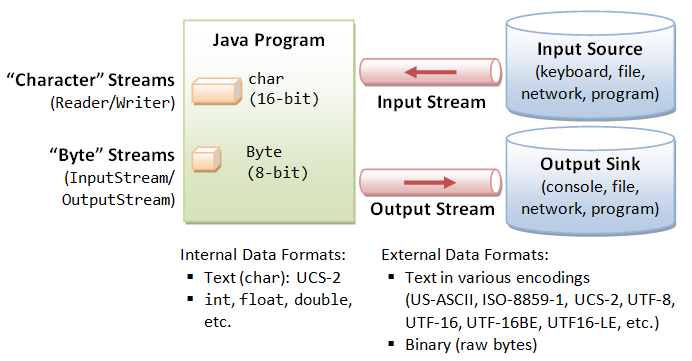
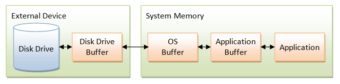

 I.        Stream I/O
 A Stream is a sequential and contiguous one way flow of data.
 There is no differentiation between the various types of data sources and sinks as 
 all are being treated as one-way sequential streams 
 Stream operations involve the following steps:
    
    1.Open an input/output stream associated with a physical device (file,console/keyboard etc)
    2.Read from the opened input stream until "end-of-stream" is rewached or write to the 
      opened output stream ,optionally flushing the buffered output
    3.Close the input/output stream
Note
 Java internally stores character (char type) in 16-bit [UCS-2] character set while the external
data source/sink can store characters in more available formats :
 [UTF-8,UTF-16,US-ASCII,ISO-8859,UTF-16LE,UTF-16BE] etc in fixed lengths of 8-bit , 16-bit  or in 
variable length of 4 to 16 bits
 Hence, Java needs to differentiate between character-based I/O for processing texts made up of charactes
and byte-based I/O for processing raw bytes
    
 
 
 A.Byte-based IO [InputStream,OutputStream] classes
 
 abstract class InputStream implements Closeable:
  //Methods
  static InputStream nullInputStream()
  void mark(int readLimit),reset() ,skipNBytes(long n),close()
  boolean markSupported()
  long skip(long n), transferTo(OutputStream out)
  abstract int read() //Read the next byte from the InputStream
  int readNBytes(int len)
      read(byte[] b)//read some bytes from the inout stream & store them into the buffer array
      read(byte[] buff,int off,int len)//Read up to len bytes of data from input stream ,
             //starting at off & store them in into the buff buffer array
  byte[] readAllByte(), readNBytes(byte[] buff,int off,int len)
  
  Subclasses:
  [FileInputStream,ByteArrayInputStream,ObjectInputStream,StringBufferInputStream
             FilterInputStream[BufferedInputStream,DataInputStream,..]]

 abstract class OutputStream:
 //Methods
 void close(),flush()
 abstract void write(int b)//
 void write(byte[] b,int off,int len)//write len bytes from the byte buffer to the Output stream,starting at off
      write(byte[] buff)//write b.length from the buffer array to the output stream
 static OutputStream nullOutputStream()

 Subclasses:
 [FileOutputStream,ObjectOutputStream,ByteArrayOutputStream,PipedOutputStream,
    FilterOutputStream[BufferedOutputStream,DataOutputStream,PrintStream]]

  Layered (Chained) I/O Streams
 I/O Streams are often layered with other I/O streams for buffering ,filtering ,data-formatting purposes etc
  eq:We can layer a BufferedInputStream into a FileInputStream (to buffer input) and stack a DataInputStream 
  for formatting data input 
      InputStream in = new BufferedInputStream(new FileInputStream("in.data"));
      DataInputStream din = new DataInputStream(in);
  
  class DataInputStream extends FilterInputStream  implements DataInput
    DataInput(InputStream in)
    //Methods
    final int read(byte[] b),read(byte[] b,int off,int len),skipBytes(int n)
              readUnsignedShort(),readUnsignedByte()
    final void readFully(byte [] b),readFully(byte []b ,int off,int len),
    final String readUTF(), readLine()
    final xxx readXXX() //xxx={boolean,char,byte,short,int,long,float,double}
    
  class DataOutputStream extendsFilterOutputStream implements DataOutput
    DataOutputStream(OutputStream out)
    //Methods
    static final String readUTF(DataInut in)
    final void write(int b),write(byte[] b,int oof,int len),
                writeXXX(xxx value) //xxx={boolean,byte,char,short,int,long,float,double}
                writeUTF(String str), writeChars(String ),writeBytes(String )
    void flush()

  class ObjectOutputStream extends implements ObjectOutput
    ObjectOutputStream(OutputStream out) 
   It writes primitive data types and graphs of java objects to an output stream
  nly objects that support the java.io.Serializable interface can be written to streams
   Non-serializable base classes must provide a no-argument constructor for their serializable
   
    //Methods
  void write(int val),write(byte[] buffer),write(byte[] b,int off,int len), 
       writeXXX(xxx val) //xxx={boolean,byte,char,short,int,long,float,double}
       writeChars(String str),writeBytes(String str),writeUTF(String str)
       flush(),close(),reset()
       defaultWriteObject()//write the non-static,non-transient fields of the curr class to the stream
  final void writeObject(Object ob)
  protected void writeObjectOverride(Object obj),drain()

  

  class ObjectInputStream extends InputStream 
        implements ObjectInput, ObjectStreamConstants
    ObjectInputStream(InputStream in)
  //Methods 
  String readUTF(),readLine()
  void readFully(byte[] b),readFully(byte[] b,int off,int len)
       close()
  int read(),read(byte[] b), read(byte[] b,int off,int len)
      readUnsignedByte(),readUnsignedShort()  
      skipBytes(int len)
  xxx readXXX() //x ={boolean,byte,char,short,int,long,float,double} 
  void defaultReadObject()// read non-static, non-transient fields of current class from the stream
  final void readObject()
  protected void readObjectOverride()  
  Notes on Object Serialization
  1.Static fields are not serialized, as they belong to the class and not to the particular instance being serialized
  1.Keyword [transient] is used to prevent a field from being serialized
  3.The writeObject(Object ) writes out the class of the object,the class signature and values of the
    non-transient and non-static fields
  4.Most of the core Java classes implement Serializable,sucha as the wrapper classes,collection and GUI classes
    Arrays of primitives or serializable objects are themselves serializable
  5.Serializable interface allows objects to be written out to an output stream serially using writeObject(Object) 
    and read back via readObject()
    The serialization runtime uses a number :serialVersionUID to ensure that the object read into the program
    is compatible with the class definition
    AWarning Message "The serialization class does not declare a static final serialVersionUID of type long
   
      private static final long serialVersionUID=1L; //version 1
      @SuppresWarnings( "serial")
      public class MyClass implements Serializable{}

    5.interface Externilizable extends Serializable :is used to customize the way a class is seriliazed
      void writeExternal(ObjectOutput out) throws IOException
      void readExternal(ObjectInput in) throws IOException,ClassNotFoundException
   
 B.Character-Streams [Reader,Writer] abstract base classes
  
 class Reader implements Readable,Closeable  :Read character streams
 Subclasses: [BufferedReader,InputStreamReader[FileReader],StringReader,PipedReader,CharArrayReader,FilterReader] 
  //Methods
  static Reader nullReader()
  int read() //read a single char
      read(char[] cbuf),read(char[] cbuf,int off,int len) //Read chars into  (portion of ) an array
      read(CharBuffer target)
  void reset(), mark(int readAheadLimit),close()
  long skip(long n), transferTo(Writer out)
  boolean markSupported()  
  
 class BufferedReader :Reads text from a character-input stream,buffering chars to provide for efficient reading
    //Methods
  void close(),mark(int lm),reset()
  boolean markSupported()
  int read(),read(char[] cbuff,int off,int len)  
  String readLines()
  Stream<String> lines()
 
 class InputStreamReader: A brigde from byte-streams to character streams
    It reads bytes and decodes them into characters using a specified Charset
  
 class Writer implements Appendable,Closeable,Flushable :Writing character streams
 Subclasses:[BufferedWriter,CharArrayWriter,OutputStreamWriter,StringWriter,PrintWriter,PipedWriter
                FilterWriter]
   //Methods
  static Writer nullWriter()
  void write(int char), write(char[] cbuf),write(char[] cbuf,int off,int len)
       write(String s), write(String s,int off, int len)
  abstract void flush() ,close()     
  Writer append(char c),append(CharSequence csq) ,append(CharSequence csq,int off,int len)
  
 class BufferedWriter 
    BufferedWriter(Writer out,..int sz)
    //Methods
  void write(int c),write(String s,int off,int len),write(char[] cbuf,int off,int len)
       flush(),close(),newLine()
 
 C.java.nio.file package
  A Path string is used to locate  file, directory or a symbolic link
  Symbolic link is a special file that references another file
  Paths can be absolute (beginning from the root '/', or relative to the current working directory)
  Unix systems use forward slash '/' for path separator ,while windows systems use backward slash '\'

 interface java.nio.file.Path :A replacement to java.io.File
  //Methods
  static Path of(String first,..String more), of(URI uri)
  Path getRoot(),getParent(), getFileName(),subpath(int beginIndx,int endIndx)
       relativize(Path other),normalize()// remove redundant name elements 
       resolve({Path|String} other)//
       resolveSibling({Path|String})
  boolean isAbsolute(),equals(Object),endsWith({Path|String}), startsWith({Path|String})
  String toString()
  URI toUri()
  FileSystem getFileSystem()
  default File toFile()
  default Iterator<Path> iterator()
  int hashCode(),compareTo(Path other, getNameCount())
  default WatchKey register(WatchService watcher,WatchEvent.Kind<?> ..events)
 class java.nio.file.Files
  //Properties of a file/directory
  public static boolean [not]exists(Path p,..LinkOption opts),isSymbolicLink(Path p),
                 isRegularFile(Path),isDirecotry(Path),
                 isReadable(Path),isWritable(Path),isExecutable(Path)
  //Copy/Move/Delete a File/Directory
  public static Path copy(Path src,Path trg,..CopyOption opts)
                 move(Path src,Path trg,..CopyOption opts)
  public static void delete(Path p) 
  public static boolean deleteIfExists(Path p)
  //Read/Write small files :Byte-based & Character-based operations
  public static Path write(path p,byte[] bytes,..OpenOption opts)
  public static byte[] readAllBytes(Path p)
  public static Path write(Path p,Iterable<? extends CharSequence> lines,Charset cs,..OpenOption)
  public static List<String> readAllLines(Path p,Charset cs)
     
  //Create new File/Directory/Symlink & temporary File/Directory
  public static Path createFile(Path p,..FileAttribute<?>attrs)
               createSymbolicLink(Path link,path trg,..FileAttribute attrs)
               createDirectory(Path dir,..FileAttribute<?> attrs)
               createDirectories(Path dir,..FileAttribute<?> attrs)
             createTempFile([Path dir],String pref,String suff,..FileAttribute<?>)
             createTempDirectory(String pref,..FileAttribute<?> attrs)
  //Create Buffered byte-based I/O and character-based I/O
  public static BufferedReader newBufferedReader(Path p,Charset chs)
  public static BufferedWriter newBufferedWriter(Path p, Charset chs,..OpenOption opts)
  //Create FileChannels
  public static SeekableByteChannel newByteChannel(Path p,..OpenOption opts)
             newByteChannel(Path p,Set<? extends OpenOption> opts,..FileAttribute attrs)
  //File Attributes
  public static Path setAttribute(Path p,)
  public static Object getAttribute(Path ,String attr,..LinkOption opts)
  
  //Directory Operations
  public static DirectoryStream<Path> newDirectoryStream(Path dir,[String glob])
  //Walking the file tree (recursively)
  public static Path walkFileTree(Path dir,FileVisitor<? super Path> visitor)
               walkFileTree(Path dir,Set<>,int maxDepth,FileVisitor<? super Path>visitor)   
  
 Notes
  1.Files.walkFileTree(Path ,FileVisitor<? super Path>):Need to create an object that implements 
     
    interface FileVisitor
    public FileVisitResult preVisitDirectory(T dir,BasicFileAttributes attrs)
               postVisitDirectory(T dir,IOException )
               VisitFile(T file,BasicFileAttributes attrs) 
               visitFileFailed(T file,IOException)

  2.public static DirectoryInputStream<Path> newDirectoryStream(Path,[String glob])
    
    A glob is a subset of regex
    *  :Matches zero or more chars
    ** :Matches zero or more chars but can cross directory boundaries 
    ? :Matches any one character
    [..] :Encloses a single char or a range of characters
    {.,.,.}:Encolses a set of subpatterns separated by ','
    
      
    
 D. Helper classes in java.io :[Scanner,Formatter] :Formatting text input & output
  1.java.io.Scanner: Formatted text from input sources [network,keyboard,file etc]
     Scanner({File|InputSream} src,[String chs]), Scanner(String src)
     Reading from keyboard :[System.in]
     //Methods
     boolean hasNext(), hasNext([{String|Pattern}]), hasNextLine()
             hasNextXXX() // XXX ={byte,boolean,short,int,long,float,double}
             hasNext(BigInteger) ,hasNext(BigDecimal)
     XXX next()
     String next(), nextLine(), next({String|Pattern}) ,toString()
     BigDecimal nextBigDecimal()
     BigInteger nextBigInteger()
     Scanner  useDelimiter({String|Pattern}),useLocale(Locale loc) ,useRadix(int r)
            skip({Pattern|String})
     void close()
     Pattern delimiter()
     String findInLine({String|Pattern}), findWithinHorizon({String|Pattern},int hr)
     Stream<String> tokens()
     Stream<MatchResult> findAll({String|Pattern})
  
  2.java.io.Formatter: An interpreter for printf-style format strings \
     Formatter({String filename|OutputStream os},..Charset chs,..Locale loc)
     Formatter(Appendable app),Formatter(Locale loc), Formatter(PrintStream ps)
     //Methods
     void close(),flush()
     String toString()
     Locale locale()
     Formatter format(String fmt,..Object args), format(Locale loc, String  fmt,..Object args)
    
  3.Format text with printf()  & String.format()
    A format specifier (fmt) begins with an '%' and ends with a conversion-type char [%d,%f]

    public PrintStream printf([Locale loc],String fmt,..Object args)  
    public PrintWriter printf([Locale loc],String fmt,..Object rgs)
    %[argument_position$][flag(s)][width][.precision]conversion_type_character    
  
  E.Charsets :java.nio.charset  :Char translation between the UCS-2 (Unicode) used internally in 
     Java programs and external devices
   Standard charsets :[UTF-8,UTF-16,UTF-16LE,UTF-16BE,ISO-8889-1,US-ASCII]
   Coded character set:A mapping between a set of abstract characters and a set of integers
   Character-encoding scheme: Mapping between a coded character set and a set of octet sequence
  class Charset:Static methods
   //Methods 
   static Charset forName(String chs,..Charset callback),defaultCharset()
   static SortedMap<String,Charset> availableCharsets()
   boolean contains(Charset cs),canEncode(),
   String displayName([Locale loc]) , name(), toString()
   final ByteBuffer encode({String|CharBuffer}) //encode Unicode chars into bytes in this charset 
   final CharBuffer decode(ByteBuffer bb)//decode bytes into Unicode chars in this charset
  
 II. NIO Buffers [java.nio] package
 Physical I/O operation is thousands times slower than memory access,so a chunk of data is often cache or 
 buffer to improve performance.
 There are many layers of cache between a physical disk and a Java program.
    Disk Buffer:It is RAM built into the disk drive to store a block of data
    OS Buffer:OS does its own buffering caching data;it is shared among applications
    Application Buffer:An app may optionally buffer its own data

 NIO data transfer is through the buffers 
 Buffer is a container ,similar to an array,of a specific primitive type
 Buffer properties :[capacity,position,limit]
   Buffer Capacity:The number of elements it contains and is fixed
   Buffer limit:The index of the first element that should not be read or written
   Buffer position:The index of the next element to be read or written
 Subclasses offer 2 categories of methods :[put,get] operations
   Relative operations:Read/write 1 or more elements starting at the current position
   Absolute operations:Take an explicit index element do not affecting the  position
 Read-only buffers:Every buffer is readable but not wri table necessarily  
 Buffers are not thread safe to be used by multiple threads simultaneously

 class Buffer :A container for data of specific primitive type
  Subclasses: [ByteBuffer,CharBuffer,ShortBuffer,IntBuffer,FloatBuffer,DoubleBuffer]
  //Methods
  final int capacity(),limit(),remaining()
  abstract int arrayOffset()// the offset of tha buffer's backing array
  abstract boolean isReadOnly(),isDirect()
  final boolean hasRemaining()
  Buffer mark(),limit(int newLim),position(int newPos)
        clear() //Set {position=0,limit=capacity,and discards mark}
        rewind()//Set {position =0,and discards mark}
        flip()//Set {limit=position,position=0,and discards mark}
  abstract Buffer duplicate(),duplicate(),slice(),slice(int idx,int len)
 abstract Object array()
 
abstract class ByteBuffer extends Buffer
   implements Comparable<ByteBuffer> 
 It is used in  Channel I/O 
 It defines the folowing categories of operations:
   1.Absolute & relative get() & put() methods that read write single bytes
   2.Absolute bulk get() and bulk put() methods that transfer contiguous sequences of bytes 
     form this buffer into an array
   3.Absolute & relative get() & put() methods that read &write values of other primitive types
     translating them into/from sequences of bytes 
   4.Methods for creating view buffers 
   5.A method for compacting a byte buffer
  
  //Methods 
  static ByteBuffer wrap(byte[] arr,..int off,int len)//wraps a byte array into a byte buffer

  abstract byte get([int index])//absolute get()
  abstract ByteBuffer put(int idx,byte b)//absolute put()
  abstract xxx getXXX(int idx) // Absolute get for reading a xxx={char,short,float,double} value
  abstract ByteBuffer put(xxx val)//Absolute put() for writing a xxx={char,short,int,float,double} value 
  
  abstract xxx getXXX()//Relative get()  ,xxx={char,int ,short,float,double}
  abstract ByteBuffer putXXX(xxx val) //Relative put() 
 
  abstract get(int index,byte[] dest,..int off,int len)//Absolute bulk get()
  ByteBuffer put(int idx,{byte[]|Bytebuffer} src,..int off,int len)
  
  Buffer get(byte []dest,..int off, int len)// Relative bulk get
        put(ByteBuffer src),put(byte[] src,..int off,int len) //Relative bulk put 
     reset(),rewind(),mark(),limit(int newLim),flip(),clear(),position(int newPosition)
  int compareTo(ByteBuffer other), hashCode(), arrayOffset(), mismatch(ByteBuffer bb2)
  abstract ByteBuffer slice(),slice(int idx,int len)
  abstract XXXBuffer asXXXBuffer() // xxx={char,short,int,long,float,double}
  abstract ByteBuffer asReadOnlyBuffer() ,duplicate()
  final byte[] array()
  

    