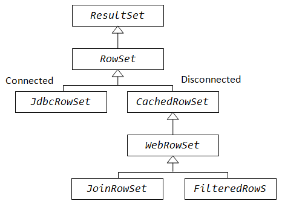

Let's create a database :ebookshop
CREATE DATABASE IF NOT EXISTS ebookshop;
USE ebookshop;
CREATE TABLE IF NOT EXISTS books(
id INT,title VARCHAR(50),author VARCHAR(50),price FLOAT, qty INT,
PRIMARY KEY (id)
);

INSERT INTO  books values (1001, 'Java for dummies', 'Tan Ah Teck', 11.11, 11);
INSERT INTO books values (1002, 'More Java for dummies', 'Tan Ah Teck', 22.22, 22),
(1003, 'More Java for more dummies', 'Mohammad Ali', 33.33, 33),
(1004, 'A Cup of Java', 'Kumar', 44.44, 44),
(1005, 'A Teaspoon of Java', 'Kevin Jones', 55.55, 55);
SELECT * FROM books;
 A.General
 A JDBC program comprises of the following steps:
  1.Allocate a Connection object to connect to the db server
  2.Allocate a Statement object, under the Connection for holding an SQL command
  3.Write an SQL query & execute the query via the Statement & Connection objects
  4.Process the query result :[]
  5.Close the Statement & Connection objects to free up resources
 
 B.Prepared Statements: [PreparedStatement]
 class PreparedStatement allows us to pass parameters & execute the same 
 SQL statement multiple times.The '?' acts as a placeholder for the parameters
 It is a pre-compiled SQL statement being more efficient than Statement 
 [setXXX(placeHolderNumber ,value)] are used to fill in the parameters
 
 C.Atomic Transaction [commit(),rollback()]
 Atomic Transaction is a group of SQL statements which either all succeed or none succeeds
 1.First we need to disable the default auto-commit mode which commits every sql statement.
 Transactions are meant to prevent partial updates to the database.
 2.Then we issue a few sql statements and then decide whether to issue a commit() to commit
  all changes or issue a rollback() to discard all changes since the latest commit.
 3.The rolback() is usually issued in the catch block ,whenever there is an error
 D.Batch Processing 
 JDBC supports batch processing of SQL statements ,to improve performance.
 Add statements to the batch via [Statement#addBatch()] or [PreparedStatement#addBatch()]
 
 E.ResultSet interface: Models the resultant table of a SELECT statement
    It provides methods for retrieving and manipulating the results of SQL queries
     
    Statement createStatement(int rsType,int rsConcurrency,..int rsHoldability)
     ResultSet.Type [FORWARD_ONLY,TYPE_SCROLL_INSENSITIVE,TYPE_SCROLL_SENSITIVE]
     Concurrency:[CONCUR_READ_ONLY,CONCUR_UPDATABEL]
     Holdability: [CLOSE_CURSORS_AT_COMMIT,HGOLD_CURSORS_AT_COMMIT]

 1.ResultSet.TYPE_SCROLL_SENSITIVE: The ResultSet is scrollable,meaning that the cursor can move
   forward,backward, to an absolute or relative row position via methods s.a 
   first(),last(),absolute(int),relative(int),beforeFirst(),afterLast(),previous(),next(),
   moveToCurrentRow(),moveToInsertRow()
   Moreover,unlike the ResultSet.TYPE_SCROLL_INSENSITIVE ,the ResultSet is sensitive to changes 
   made by others in the data source while it is opened
 2.ResultSet.CONCUR_UPDATABLE: The ResultSet is updatable through methods [updateXXX()]
 3.Holdability:By default, the ResultSet objects and cursors are closed when commit() is called.
  (ResultSet.CLOSE_CURSORS_AT_COMMIT).Holding cursors open afer commit() is achieved if specifying
  ResultSet.HOLD_CURSORS_OVER_COMMIT
 
 F.RowSet interface 
   A RowSet object is scrollable and updatable by default
   It supports JavaBeans component & JavaBeans Event model
   There are 2 types of RowSets :[Connected ,disconnected]
   Implementations:
     JdbcRowSet:A connected RowSet ,a wrapper to a scrollable and updatable ResultSet
     CachedRowSet: Defines the basic capabilities of disconnected RowSets
     WebRowSet:Sub-interface of CachedRowSet ,uses XML documents
     JoinRowSet:Sub-interface of WebRowSet ,can form the equivalent of SQL JOIN without having to connect to a data source
     FilteredRowSet:Sub-interface of WebRowSet, can perform queries on RowSet objects while being disconnected
   