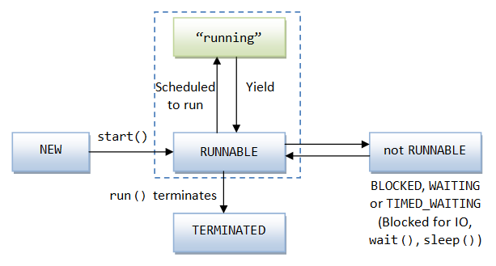
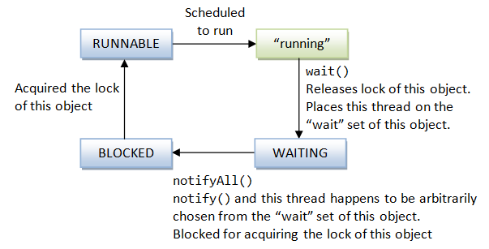

  Concurrency & Multi-Threading 
  I.Threads & Synchronization
   A single-thread program has a single entry point ,the main(),and a single exit point
   A multi-thread 
   class Thread : A thread of execution in a program 
  Thread(),Thread([Runnable trg],String name)
  Thread(ThreadGroup, Runnable trg,..String name,
        ...long stackSize,..boolean inheritThreadLocals)
  //Methods
  static int activeCount(),enumerate(Thread[] tarr)
  static Thread currentThread()
  static boolean interrupted(), holdsLock(Object obj)
  static void yield() //a hint to scheduler that the current thread is willing to yield its use of processor
        sleep(long millis,..int nanos) ,dumpStack()
  final void join(),join(long millis,...int nanos) //waits for the thread to die (at most millis +nanos)
           setName(String),setPriority(int),setDaemon(boolean on)
  void interrupt()//Interrupts the current thread
       setUncaughtExceptionHandler(Thread.UncaughtExceptionHandler eh)
       start() //Causes this thread to begin execution-> JVM calls this thread's run()
       run()
  boolean isAlive(),isDaemon(),isInterrupted()
  protected Object clone()
  
  
  Thread Life Cycle
 

  Thread states:[NEW,RUNNABLE,BLOCKED,WAITING,TIMED_WAITING,TERMINATED]
  public static enum Thread.State extends Enum<Thread.State>
  
    New:A thread that has not been started yet
    RUNNABLE:A thread executing in the JVM
    BLOCKED:A thread waiting for a monitor lock
    WAITING:A thread that is waiting indefinately for another thread 
                  to perform an action
    TIMED_WAITING:A thread that is waiting  for another thread to perform 
                  an action for a specified time
    TERMINATED:A that has exited
        //Methods
      static Thread.State valueOf(String name)
      static Thread.State[] values()

  Thread Scheduling [public void setPriority(int pr)] ,pr :{1,10}
  JVM chooses the highest-priority thread of execution
    
  
  

    @Functional
    interface Runnable 
    //method
    void run()  //an obj of the implementing class that is used to create a thread
                //calling start() (starting the thread)causes the object's run() 
                //to be called in that separate executing thread 
 Implementing classes:[Thread,SwingWorker,FutureTask,ForkJoinWorkerThread,TimerTask]

 Notes
  1.Daemon threads are infrastructure thread (eq GUI's event dispatcher thread,GC thread)
    The JVM exits,considering its job done if there are only daemon threads
  2.Starvation is the state where 1 or more thread is deprived of the chance to access an object    
    Need to set correct priorities to all threads of execution
  3.Deadloack is a situation where a thread is waiting for a condition 
  4.Creating a new thread is achieved by :
  (i)Extending class Thread and override its run() method.An anonymous class can be used
     or
  (ii)Creating a class that implements Runnable and provide the implementation of the abstract run()

    class Myclass extends Thread{
      @Override 
      public void run(){...}
    }
    class MyClass2 implements Runnable{
      @Override 
      public void run(){...}
    class Main{
       public static void main(String[] args){
         MyClass t1 = new MyClass();
         MyClass2 = new MyClass2();
         t1.start();
         t2.statrt();
         new Myclass().start();
         Thread t3 = new Thread(){
            @Override public void run(){
               ...
            }
         };
       }
    }
  Monitor Lock
  Monitor is an object that can be used to block and revive a thread.It is supported via 
the following mechanism:
    1.A lock for an object: Each Java object has a lock which ,at any time, is controlled by,
      at most 1 thread
    2.The keyword synchronized for accessing the object's lock
    3.The wait(),notify(),notifyAll() methods defined in Object class 
 We can mark a block of code,or a method with the keyword synchronized.A thread that wants to execute
  an object's synchronized code must first attempt to acquire the object's lock 
 If the lock is held by another thread ,then the attempting thread will wait ,getting into the Seeking Lock
  state 
 When a thread that holds the lock completes the synchronized code ,it gives up the lock
 Variables cannot be synchronized;Instead ,synchronize all the methods that access the variables

    //synchronizing a method based on this object
    public class MyClass{
      private static int counter = 0; 
      public synchrinized void methA(){//...}
      public void methB(){
        synchronized(this){ //synchronizing a block of code 
          //...             based on this oject
        }
        synchronized(anObject){//synchronizing a bloc of code based
          //...                  on another object
        }
      }
      //synchronize the methods that access static variable counter
      public static synchronized void increment(){ ++counter;}
      public static synchronized void decrement(){--counter;}
    }
 The wait(),notify(),notifyAll() can be called only in synchronous code 
 
    public final void notify()//Wake up a single thread (arbitrarilly)that is waiting on 
                              //this object's monitor
               notifyAll() //wake up all the waiting threads on this object's monitor
             wait() throws InterruptedException //Causes the current thread tto wait 
                             //until being awakened by being notified or interrupted
             wait(long timeoutMillis ,[int nanos] )
    
 
 II.Executors and Thread Pool [java.util.concurrent]
 
 Thread Pool is a managed collection of threads that are available for executing tasks.
 These threads are re-cycled reducing per-task invocation overhead.
 Executor is an object that can execute submitted Runnable tasks
 ExecutorService is an Executor  that provides methods to manage termination and methods
 that produce  Future for tracking progress of asynchronous tasks. 
 ScheduledExecutorService is an object that can schedule commands to run after a given 
 delay or execute periodically
 Callable is  similar to Runnable,it represents a task submitted, but returns a result 
 or throws an Exception.
 Future represents the result of an asynchronous computation

    interface Callable<V>
    //Methods
    V call()//computes a result or throws Exception

    interface Future<V>
    //Methods
    boolean cancel(boolean mayInterruptIfRunning),isDone()
    V       get(),get(long tm,TimeUnit un)

    interface Executor 
     //Methods
     public void execute(Runnable r)
    
    interface ScheduledExecutorService extends Executor
    //Methods
    Future<?> submit(Runnable task)
    <T>Future<T> submit(Runnable task, T result),sumbit(Callable<T>task)
    boolean isShutdown(),isTerminated()
    <T> T invokeAny(Collection<? extends Callable<T> tasks,..long tm,TimeUnint un)
    <T> List<Future<T>> invokeAll(Collection<?extends Callable<T>> tasks,..
           long tm,TimeUnint un)
    boolean awaitTermination(long tm,TimeUnit unt)
   
    interface ScheduledExecutorService
    //Methods
    ScheduledFuture<?> schedule(Runnable cmd.long delay,TimeUnit un)
                    scheduleAtFiexedRate(Runnable cmd,long initDeolay,long pewriod,TimeUnit un)
                    scheduleWithFixedDelay() 
    <V> ScheduledFuture<V> schedule(Callable<V> cmd,long delay,TimeUnit un)
    
    emum TimeUnit extends Enum<TimeUnit>
    Constants: [DAYS,HOURS,MINUTES,SECONDS,MICROSECONDS,MILLISECONDS,NANOSECONDS]
    //Methods 
    long toYYY(lond duration) //
    static TimeUnit valueOf(String name)
    static TimeUnit[] values()
    
    class Executors 
        //Mehods
    static ExecutorService  newSingleThreadExecutor([ThreadFacory])
                     newFixedThreadPool(int num,[ThreadFactory]),
                     newCachedThreadPool([ThreadFacory])
        static ScheduledExecutorService newSingleThreadScheduledExecuor([ThreadFactory])
         

 III. package [java.uytil.concurent.atomic]
 Supports lock-free,thread safe  programming on single variables
 classes :[AtomicBoolean,AtomicInteger,AtomicLong,AtomicIntegerArray,AtomicLongArray,AtomicReference,AtomicReferenceArray]

 class AtomicLong extends Number implements Serializable  
  A long value that may be updated atomically
   AtomicLong(),AtomicLong(long initValue)
  //Methods
  long longValue()
  final long get(),getAndAdd(long delta),getAcquire(),
          getPlain(),getyOpaque()
          getAndIncrement(), getAndDecrement(),getAndSet(long nv)
          addAndGet(long delta),decrementAndGet(),
          getAndUpdate(LongUnaryOperator func),
          getAndAccxumulate(long ,LongBinaryoperator accumFunc)
  final void set(long val),setPlain(long nv),setOpaque(long nv)
              setRelease(long nv)
        